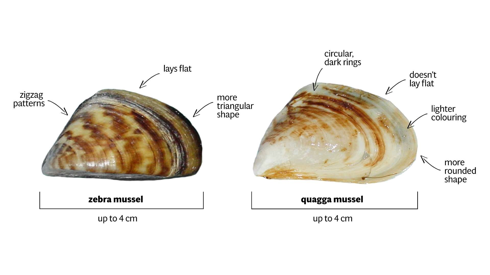
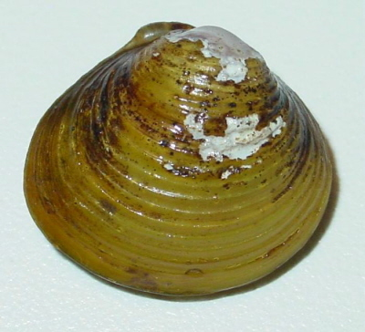

# Introduction

```{r, warning=FALSE, message=FALSE, include=FALSE}
#| label: load in libraries and data

#libraries
pacman::p_load(tidyverse, downloader, readxl, readr, mosaic, rio, haven, foreign, pander, ggthemes, ggrepel, directlabels, gapminder, stringi, stringr, forcats, pander, purr, Lahman, priceR, riem, USAboundaries, USAboundariesData, geofacet, leaflet)

library(sf, warn.conflicts = F)

#data
zm <- read_csv("https://raw.githubusercontent.com/calvin772/Calvin-PB-Portfolio/refs/heads/main/data/NAS-Data-Download-Zebra-Mussels26%20copy/NAS-Specimen-Download.csv")
qm <- read.csv("https://raw.githubusercontent.com/calvin772/Calvin-PB-Portfolio/refs/heads/main/data/NAS-Data-Download-quagga-mussel26/NAS-Specimen-Download.csv")
gc <- read.csv("https://raw.githubusercontent.com/calvin772/Calvin-PB-Portfolio/refs/heads/main/data/NAS-Data-Download-golden-clam26/NAS-Specimen-Download.csv")

```





```{r, warning=FALSE, message=FALSE, include=FALSE}
#| label: wrangle and customize data

# synchronise zm dataset
colnames(zm) <- colnames(qm)
zm <- zm %>%
  mutate(HUC.8.Number = as.numeric(HUC.8.Number))

# combine datasets
ex.bivalv <- bind_rows(zm, qm, gc) %>%
  filter(Country == "United States of America",
         Year >= 1990) %>%
  select(1:17)

# create a year dataset
year.x.bv <- ex.bivalv %>%
  group_by(Year, Species.ID) %>%
  summarise(Count = n())

# load in state boundary dataset
states <- us_states() %>%
  filter(
    !state_name %in% c("Alaska", "Hawaii", "Puerto Rico"))

# create map datasets of records since 2020
map.bivalv <- ex.bivalv %>%
  filter(Year != 2024 | State != "WA") %>%
  filter(Year >= 2020)

zm.map.bivalv <- map.bivalv %>%
  filter(Species.ID == 5)
qm.map.bivalv <- map.bivalv %>%
  filter(Species.ID == 95)
gc.map.bivalv <- map.bivalv %>%
  filter(Species.ID == 92)

# create count dataset on top 5 most invaded state
count.bivalv <- map.bivalv %>%
  group_by(State, Common.Name) %>%
  summarise(Count = n()) %>%
  mutate(Total.Count = sum(Count)) %>%
  arrange(desc(Total.Count)) %>%
  head(15)
```

```{r, warning=FALSE, message=FALSE}
#| label: Plotting Invasive Trends

# color pallete
bivalve_pallette <- c("5" = "#8F4444", "95" = "#060303", "92" = "#A99E26")

# plotting trend of invasive populations over the decades
ggplot(year.x.bv, aes(x=Year, y=Count, col=as.factor(Species.ID))) +
  geom_point() +
  geom_smooth(method = "loess", se = FALSE) +
  scale_color_manual(values = bivalve_pallette) +
  scale_y_continuous(n.breaks = 8) +
  labs(
    title = "Invasive Species Sightings Across The Years",
    y = "Detections")+
  theme_bw() +
  theme(
    panel.border = element_blank(),
    axis.ticks = element_blank(),
    legend.position = "Null",
    axis.title.x = element_blank())+
  annotate("text", x=2003, y=300, label="Zebra Mussel", color = "#8F4444")+
  annotate("text", x=1995, y=75, label="Quagga Mussel", color = "#060303")+
  annotate("text", x=2007, y=700, label="Golden Clam", color = "#A99E26")
```

```{r, warning=FALSE, message=FALSE}
#| label: Plotting 2020 to 2025 map


# creating interactive map of invasive populations since 2020
leaflet() %>%
  addTiles(group = "OSM (default)") %>%
  addProviderTiles(providers$Esri.WorldImagery, 
                   group = "World Imagery") %>%
  setView(lng = -100, lat = 40, zoom = 3.5) %>%
  addPolygons(
    data = states,
    color = "#2E8B57", 
    weight = 3, 
    fill = FALSE,
    group = "State Borders") %>%
  addCircles(
    data = zm.map.bivalv, 
    color = "#8F4444",
    group = "Zebra Mussel",
    weight = 7) %>%
  addCircles(
    data = qm.map.bivalv, 
    color = "#060303",
    group = "Quagga Mussel",
    weight = 7) %>%
  addCircles(
    data = gc.map.bivalv, 
    color = "#A99E26",
    group = "Golden Clam",
    weight = 7) %>%
  addLayersControl(
      baseGroups = c("OSM (default)", "World Imagery"),
      overlayGroups = c(
      "State Borders",
      "Zebra Mussel",
      "Quagga Mussel",
      "Golden Clam"),
      options = layersControlOptions(collapsed = FALSE)
    )
  
  
```

```{r, warning=FALSE, message=FALSE}
#| label: Table of Invasive Counts in States

# pivot count dataset for presenting
pivot.bivalv <- count.bivalv %>%
  pivot_wider(names_from = Common.Name, values_from = Count)

# create table of counts
pander(pivot.bivalv) 
```

